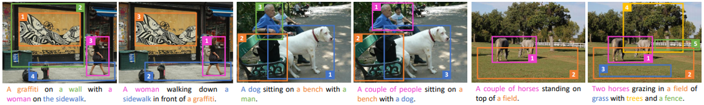
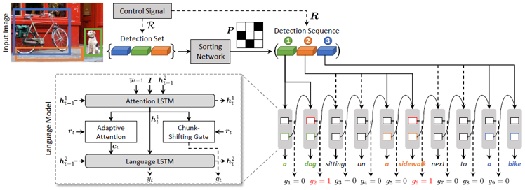
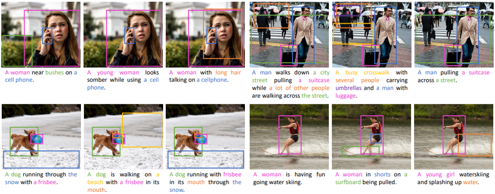

# Show, Control and Tell
This repository contains the reference code for the paper _[Show, Control and Tell: A Framework for Generating Controllable and Grounded Captions](https://arxiv.org/pdf/1811.10652.pdf)_ (CVPR 2019).

Please cite with the following BibTeX:

```
@inproceedings{cornia2019show,
  title={{Show, Control and Tell: A Framework for Generating Controllable and Grounded Captions}},
  author={Cornia, Marcella and Baraldi, Lorenzo and Cucchiara, Rita},
  booktitle={Proceedings of the IEEE/CVF Conference on Computer Vision and Pattern Recognition},
  year={2019}
}
```





## Environment setup
Clone the repository and create the `sct` conda environment using the `conda.yml` file:
```
conda env create -f conda.yml
conda activate sct
```
Our code is based on [SpeakSee](https://github.com/aimagelab/speaksee): a Python package that provides utilities for working with Visual-Semantic data, developed by us. The conda enviroment we provide already includes a beta version of this package. 

## Data preparation
### COCO Entities
Download the annotations and metadata file [dataset_coco.tgz](https://ailb-web.ing.unimore.it/publicfiles/drive/show-control-and-tell/dataset_coco.tgz) (~85.6 MB) and extract it in the code folder using `tar -xzvf dataset_coco.tgz`. 

Download the pre-computed features file [coco_detections.hdf5](https://ailb-web.ing.unimore.it/publicfiles/drive/show-control-and-tell/coco_detections.hdf5) (~53.5 GB) and place it under the `datasets/coco` folder, which gets created after decompressing the annotation file.

### Flickr30k Entities
As before, download the annotations and metadata file [dataset_flickr.tgz](https://ailb-web.ing.unimore.it/publicfiles/drive/show-control-and-tell/dataset_flickr.tgz) (~32.8 MB) and extract it in the code folder using `tar -xzvf dataset_flickr.tgz`. 

Download the pre-computed features file [flickr30k_detections.hdf5](https://ailb-web.ing.unimore.it/publicfiles/drive/show-control-and-tell/flickr30k_detections.hdf5) (~13.1 GB) and place it under the `datasets/flickr` folder, which gets created after decompressing the annotation file.

## Evaluation
To reproduce the results in the paper, download the pretrained model file [saved_models.tgz](https://ailb-web.ing.unimore.it/publicfiles/drive/show-control-and-tell/saved_models.tgz) (~4 GB) and extract it in the code folder with `tar -xzvf saved_models.tgz`.

### Sequence controllability
Run `python test_region_sequence.py` using the following arguments:

| Argument | Possible values |
|------|------|
| `--dataset` | `coco`, `flickr` |
| `--exp_name` | `ours`, `ours_without_visual_sentinel`, `ours_with_single_sentinel` |
| `--sample_rl` | If used, tests the model with CIDEr optimization |
| `--sample_rl_nw` | If used, tests the model with CIDEr + NW optimization |
| `--batch_size` | Batch size (default: 16) |
| `--nb_workers` | Number of workers (default: 0) |

For example, to reproduce the results of our full model trained on COCO-Entities with CIDEr+NW optimization (Table 2, bottom right), use:
```
python test_region_sequence.py --dataset coco --exp_name ours --sample_rl_nw  
```

### Set controllability
Run `python test_region_set.py` using the following arguments:

| Argument | Possible values |
|------|------|
| `--dataset` | `coco`, `flickr` |
| `--exp_name` | `ours`, `ours_without_visual_sentinel`, `ours_with_single_sentinel` |
| `--sample_rl` | If used, tests the model with CIDEr optimization |
| `--sample_rl_nw` | If used, tests the model with CIDEr + NW optimization |
| `--batch_size` | Batch size (default: 16) |
| `--nb_workers` | Number of workers (default: 0) |

For example, to reproduce the results of our full model trained on COCO-Entities with CIDEr+NW optimization (Table 4, bottom row), use:
```
python test_region_set.py --dataset coco --exp_name ours --sample_rl_nw  
```

### Expected output
Under `logs/`, you may also find the expected output of all experiments. 

## Training procedure
Run `python train.py` using the following arguments:

| Argument | Possible values |
|------|------|
| `--exp_name` | Experiment name |
| `--batch_size` | Batch size (default: 100) |
| `--lr` | Initial learning rate (default: 5e-4) |
| `--nb_workers` | Number of workers (default: 0) |
| `--sample_rl` | If used, the model will be trained with CIDEr optimization |
| `--sample_rl_nw` | If used, the model will be trained with CIDEr + NW optimization |

For example, to train the model with cross entropy, use:
```
python train.py --exp_name show_control_and_tell --batch_size 100 --lr 5e-4 
```

To train the model with CIDEr optimization (after training the model with cross entropy), use:
```
python train.py --exp_name show_control_and_tell --batch_size 100 --lr 5e-5 --sample_rl
```

To train the model with CIDEr + NW optimization (after training the model with cross entropy), use:
```
python train.py --exp_name show_control_and_tell --batch_size 100 --lr 5e-5 --sample_rl_nw
```

Note: the current training code only supports the use of the COCO Entities dataset.



## COCO Entities
If you want to use only the annotations of our COCO Entities dataset, you can download the annotation file [coco_entities_release.json](https://ailb-web.ing.unimore.it/publicfiles/drive/show-control-and-tell/coco_entities_release.json) (~403 MB).

The annotation file contains a python dictionary structured as follows:
```
coco_entities_release.json
 └── <id_image>
      └── <caption>
           └── 'det_sequences'
           └── 'noun_chunks'
           └── 'detections'
           └── 'split'
```
In details, for each image-caption pair, we provide the following information:
* `det_sequences`, which contains a list of detection classes associated to each word of the caption (for an exact match with caption words, split the caption by spaces). `None` indicates the words that are not part of noun chunks, while `_` indicates noun chunk words for which an association with a detection in the image was not possible. 
* `noun_chunks`, which is a list of tuples representing the noun chunks of the captions associated with a detection in the image. Each tuple is composed by two elements: the first one represents the noun chunk in the caption, while the second is the detection class associated to that noun chunk.
* `detections`, which contains a dictionary with a number of elements equal to the number of detection classes associated with at least a noun chunk in the caption. For each detection class, it provides a list of tuples representing the image regions detected by Faster R-CNN re-trained on Visual Genome [1] and corresponding to that detection class. Each tuple is composed by the detection id and the corresponding boundig box in the form `[x1, y1, x2, y2]`. The detection id can be used to recover the detection feature vector from  the pre-computed features file [coco_detections.hdf5](https://ailb-web.ing.unimore.it/publicfiles/drive/show-control-and-tell/coco_detections.hdf5) (~53.5 GB). See the demo section below for more details. 
* `split`, which indicates the dataset split of that sample (_i.e._ train, val or test) following the COCO splits provided by [2].

Note that this annotation file includes all image-caption pairs for which at least one noun chunk-detection association has been found. However, in validation and testing phase of our controllable captioning model, we dropped all captions with empty region sets (_i.e._ those captions with at least one `_` in the `det_sequences` field). 



_By downloading the dataset, you declare that you will use it for research and educational purposes only, any commercial
 use is prohibited._

### Demo
An example of how to use the COCO Entities annotations can be found in the [coco_entities_demo.ipynb](demo/coco_entities_demo.ipynb) file.


### References
[1] P. Anderson, X. He, C. Buehler, D. Teney, M. Johnson, S. Gould, and L. Zhang. Bottom-up and top-down attention for image captioning and visual question answering. In _Proceedings of the IEEE Conference on Computer Vision and Pattern Recognition_, 2018.

[2] A. Karpathy and L. Fei-Fei. Deep visual-semantic alignments for generating image descriptions. In _Proceedings of the IEEE Conference on Computer Vision and Pattern Recognition_, 2015.

## Contact

If you have any general doubt about our work, please use the [public issues section](https://github.com/aimagelab/show-control-and-tell/issues) on this github repo. Alternatively, drop us an e-mail at marcella.cornia [at] unimore.it or lorenzo.baraldi [at] unimore.it.
